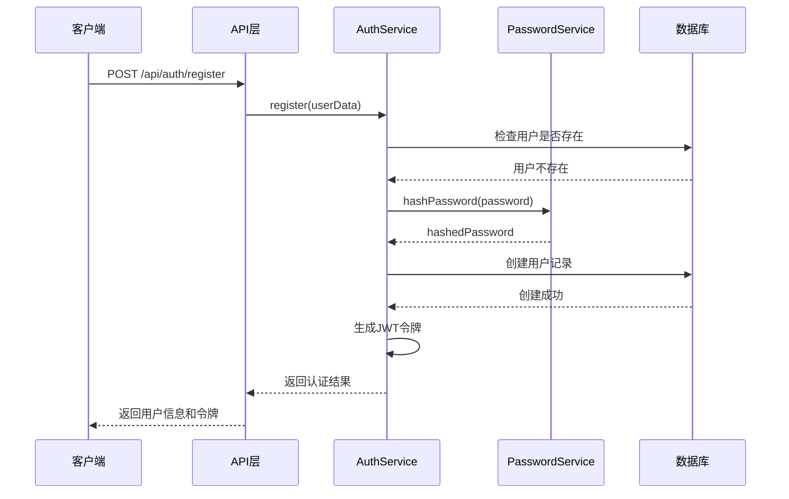
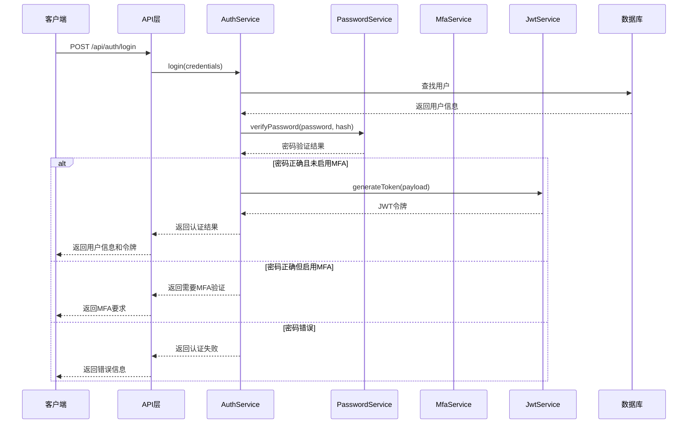
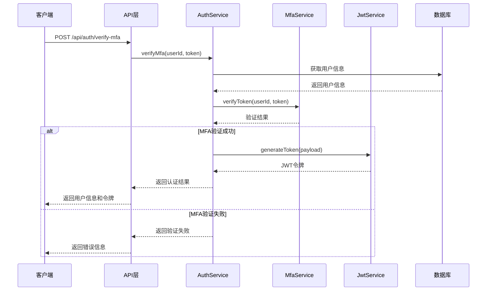
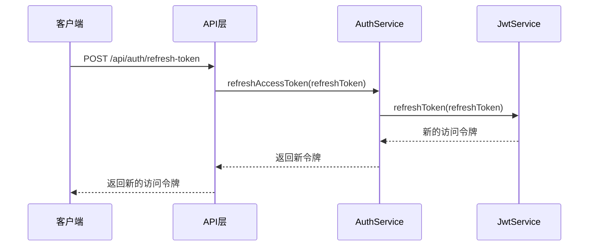

# 认证系统迁移文档

## 1. 概述

本文档详细说明了从 MelodyAuth 认证系统迁移到轻量级认证系统的方案。迁移的主要目标是简化认证架构，减少外部依赖，提高系统的自主可控性和安全性。

### 1.1 迁移原因

- **减少外部依赖**: 当前系统依赖 MelodyAuth 外部服务，增加了系统的复杂性和故障点
- **提高性能**: 本地认证服务可以减少网络延迟，提高认证响应速度
- **增强安全性**: 轻量级认证系统使用标准的安全库，减少潜在的安全风险
- **简化部署**: 不需要额外部署和维护 MelodyAuth 服务
- **降低成本**: 减少对外部服务的依赖，降低运营成本

### 1.2 迁移目标

- 实现完全自主可控的认证系统
- 保持现有API接口的兼容性
- 确保用户数据和会话的平滑迁移
- 提高认证流程的安全性和可靠性
- 简化系统架构和部署流程

## 2. 当前问题

### 2.1 MelodyAuth 的问题和局限性

1. **外部依赖风险**
   - MelodyAuth 服务不可用时，整个系统认证功能将失效
   - 网络连接问题可能导致认证失败
   - 外部服务更新可能影响系统稳定性

2. **性能瓶颈**
   - 每次认证请求都需要网络往返，增加延迟
   - 外部服务的性能限制可能影响系统整体性能
   - 高并发场景下可能出现认证请求排队

3. **安全风险**
   - 需要在网络中传输敏感认证信息
   - 外部服务的安全漏洞可能影响本系统
   - 难以对认证流程进行细粒度的安全控制

4. **维护复杂性**
   - 需要维护两个系统的配置和同步
   - 外部服务的更新和变更需要及时跟进
   - 故障排查需要跨系统协作

5. **成本问题**
   - 可能需要支付外部服务使用费用
   - 需要额外资源维护外部服务连接

## 3. 新架构设计

### 3.1 轻量级认证系统架构

新的轻量级认证系统采用模块化设计，包含以下核心组件：

1. **JwtService**: 负责JWT令牌的生成、验证和刷新
2. **MfaService**: 处理多因素认证相关功能
3. **PasswordService**: 处理密码哈希、验证和强度检查

### 3.2 架构优势

1. **自主可控**: 所有认证逻辑都在系统内部，不依赖外部服务
2. **高性能**: 本地处理认证请求，减少网络延迟
3. **安全性**: 使用标准安全库，实现端到端的安全控制
4. **可扩展性**: 模块化设计便于功能扩展和定制
5. **易维护**: 统一的代码库和配置，简化维护工作

### 3.3 数据存储

- 用户数据继续存储在现有SQLite数据库中
- JWT令牌无需持久化存储，采用无状态设计
- MFA密钥安全存储在用户表中

## 4. 技术栈

新的轻量级认证系统基于以下技术栈：

1. **jsonwebtoken**: 用于JWT令牌的生成和验证
   - 支持多种签名算法
   - 提供令牌过期和刷新机制
   - 广泛使用，社区支持良好

2. **speakeasy**: 用于多因素认证(MFA)
   - 支持TOTP(基于时间的一次性密码)
   - 提供二维码生成功能
   - 兼容Google Authenticator等主流MFA应用

3. **bcrypt**: 用于密码哈希和验证
   - 提供自适应哈希函数
   - 内置盐值生成
   - 抗彩虹表攻击

### 4.1 技术选型理由

1. **jsonwebtoken**
   - 行业标准，广泛使用
   - 支持无状态认证
   - 易于集成和扩展

2. **speakeasy**
   - 支持标准MFA协议
   - 提供完整的MFA解决方案
   - 轻量级，易于部署

3. **bcrypt**
   - 专为密码哈希设计
   - 可调节的计算复杂度
   - 经过广泛安全验证

## 5. 认证流程

### 5.1 用户注册流程

### 5.2 用户登录流程

### 5.3 MFA验证流程

### 5.4 令牌刷新流程

## 6. 安全考虑

### 6.1 密码策略

1. **密码强度要求**
   - 最小长度: 8个字符
   - 包含大小写字母、数字和特殊字符
   - 禁止使用常见密码和字典词汇

2. **密码存储**
   - 使用bcrypt进行哈希处理
   - 设置适当的盐值轮次(建议12轮)
   - 不存储明文密码

3. **密码重置**
   - 提供安全的密码重置流程
   - 使用一次性令牌，有效期限制
   - 重置后强制用户更改密码

### 6.2 令牌安全

1. **JWT令牌配置**
   - 使用强随机密钥签名
   - 设置合理的过期时间(访问令牌15分钟，刷新令牌7天)
   - 包含必要的用户信息和权限

2. **令牌传输**
   - 仅通过HTTPS传输
   - 使用Authorization头传输
   - 不在URL中包含令牌

3. **令牌存储**
   - 客户端安全存储(如httpOnly cookies)
   - 服务器端不存储令牌(无状态设计)
   - 提供令牌撤销机制

### 6.3 MFA实现

1. **MFA配置**
   - 使用TOTP算法
   - 提供二维码和手动输入密钥选项
   - 支持多种认证器应用

2. **MFA安全**
   - 密钥安全存储在数据库
   - 提供备份恢复码
   - 支持MFA重置流程

3. **MFA验证**
   - 令牌有效期限制(30秒)
   - 防止暴力破解
   - 记录验证尝试和失败

## 7. 实施计划

### 7.1 阶段一: 准备阶段 (1周)

1. **环境准备**
   - 设置开发和测试环境
   - 安装必要的依赖包
   - 配置CI/CD流程

2. **代码准备**
   - 创建新的服务类框架
   - 定义接口和数据结构
   - 编写单元测试用例

3. **安全准备**
   - 生成JWT密钥
   - 配置安全策略
   - 准备迁移脚本

### 7.2 阶段二: 开发阶段 (2周)

1. **核心服务开发**
   - 实现JwtService
   - 实现MfaService
   - 实现PasswordService

2. **集成开发**
   - 修改AuthService以使用新服务
   - 更新API控制器
   - 实现错误处理和日志记录

3. **测试开发**
   - 执行单元测试
   - 执行集成测试
   - 执行安全测试

### 7.3 阶段三: 部署阶段 (1周)

1. **预生产部署**
   - 在预生产环境部署新系统
   - 执行全面测试
   - 性能优化和调优

2. **生产部署**
   - 制定部署计划
   - 执行灰度发布
   - 监控系统状态

3. **后部署支持**
   - 监控系统性能
   - 处理用户反馈
   - 必要时执行回滚

### 7.4 阶段四: 清理阶段 (1周)

1. **代码清理**
   - 移除MelodyAuth相关代码
   - 更新文档和注释
   - 代码审查和优化

2. **配置清理**
   - 移除MelodyAuth配置
   - 更新环境变量
   - 清理不必要的依赖

3. **文档更新**
   - 更新API文档
   - 更新部署文档
   - 更新用户手册

## 8. 风险评估

### 8.1 技术风险

1. **兼容性风险**
   - **风险**: 新系统可能与现有组件不兼容
   - **缓解措施**: 全面测试，保持API接口兼容性
   - **应急计划**: 准备回滚到MelodyAuth的方案

2. **性能风险**
   - **风险**: 本地认证可能影响系统性能
   - **缓解措施**: 性能测试，优化代码，考虑缓存策略
   - **应急计划**: 增加服务器资源，优化数据库查询

3. **安全风险**
   - **风险**: 新实现可能存在安全漏洞
   - **缓解措施**: 安全审计，渗透测试，使用标准安全库
   - **应急计划**: 快速补丁发布，临时禁用受影响功能

### 8.2 运营风险

1. **迁移风险**
   - **风险**: 数据迁移可能导致数据丢失或损坏
   - **缓解措施**: 数据备份，分步迁移，验证数据完整性
   - **应急计划**: 从备份恢复数据，暂停迁移过程

2. **用户体验风险**
   - **风险**: 迁移可能影响用户体验
   - **缓解措施**: 保持UI一致性，提供迁移指南，用户培训
   - **应急计划**: 提供支持渠道，快速修复用户体验问题

3. **可用性风险**
   - **风险**: 系统在迁移过程中可能不可用
   - **缓解措施**: 灰度发布，监控告警，快速回滚机制
   - **应急计划**: 立即回滚到旧系统，通知用户

### 8.3 业务风险

1. **项目延期风险**
   - **风险**: 迁移可能需要比预期更长的时间
   - **缓解措施**: 详细计划，定期评估，灵活调整
   - **应急计划**: 分阶段交付，优先核心功能

2. **成本超支风险**
   - **风险**: 迁移可能超出预算
   - **缓解措施**: 详细预算评估，定期审查，成本控制
   - **应急计划**: 调整项目范围，申请额外资源

## 9. 向后兼容性

### 9.1 API兼容性

1. **保持现有API接口**
   - 所有现有API端点保持不变
   - 请求和响应格式保持一致
   - HTTP状态码和错误消息保持兼容

2. **渐进式增强**
   - 新功能通过新API端点提供
   - 旧API端点继续支持
   - 提供API版本控制机制

3. **弃用计划**
   - 提前通知API变更
   - 提供迁移指南
   - 给予足够的过渡期

### 9.2 数据兼容性

1. **数据库结构兼容**
   - 保持现有表结构
   - 新增字段提供默认值
   - 不删除现有字段

2. **数据迁移策略**
   - 现有数据无需迁移
   - 新数据格式向后兼容
   - 提供数据转换工具

3. **配置兼容性**
   - 保持现有配置项
   - 新配置项提供默认值
   - 配置文件格式保持不变

### 9.3 客户端兼容性

1. **Web客户端兼容**
   - 现有Web客户端无需修改
   - 新功能通过渐进式增强提供
   - 保持UI/UX一致性

2. **移动客户端兼容**
   - API接口保持兼容
   - 认证流程保持一致
   - 提供更新指南

3. **第三方集成兼容**
   - 保持API接口稳定
   - 提供集成文档
   - 提前通知重大变更

## 10. 总结

从MelodyAuth迁移到轻量级认证系统是一个重要的架构决策，将显著提高系统的自主可控性、性能和安全性。通过详细的实施计划和风险缓解措施，我们可以确保迁移过程的平稳进行，最小化对用户和业务的影响。

新的轻量级认证系统基于行业标准的安全库，提供完整的认证和授权功能，同时保持与现有系统的兼容性。通过模块化设计，系统具有良好的可扩展性和可维护性，为未来的功能扩展奠定了坚实的基础。

迁移完成后，系统将拥有更简洁的架构、更高的性能和更强的安全性，为用户提供更好的体验，为运维人员提供更简便的管理方式。
